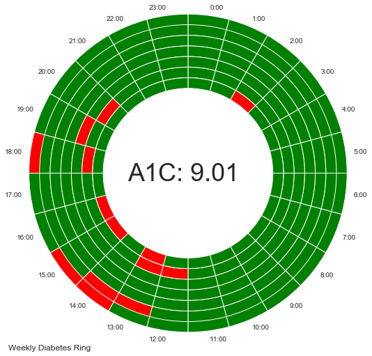

# Diabetes-Ring
Notebook the generates a weekly or daily diabetes ring using data from the Dexcom API.

# Questions
* How's your blood sugar?  
* What are your numbers?  
* Are you under contol?  
* Do you ever get lows? 
* What about night time?  Do you have any dangerous lows at night time?

These are some questions I get asked by doctors and people all the time!  What do I say?  With an inundation of glucose data thanks to dexcom, how do I summarize this into an easy to understand graphic that can be understood by laypeople?

Answer: A diabetes ring!  See images below:

* Red means out of range (range specified in notebook)
* Green means in range
* Ring represents 24 hr period

* Red means out of range (range specified in notebook)
* Green means in range
* Outer ring is Monday
* Inner ring is Sunday
* Ring represents 24 hr period

