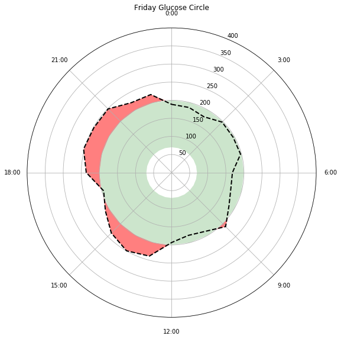

# Diabetes-Ring
Notebook the generates a weekly or daily diabetes ring using data from the Dexcom API.

* Red means out of range (range specified in notebook)
* Green means in range
* Ring represents 24 hr period

* Red means out of range (range specified in notebook)
* Green means in range
* Outer ring is Monday
* Inner ring is Sunday
* Ring represents 24 hr period

* Red means out of range (range specified in notebook)
* Yellow means look out!
* Green means in range
* Ring represents 24 hr period
